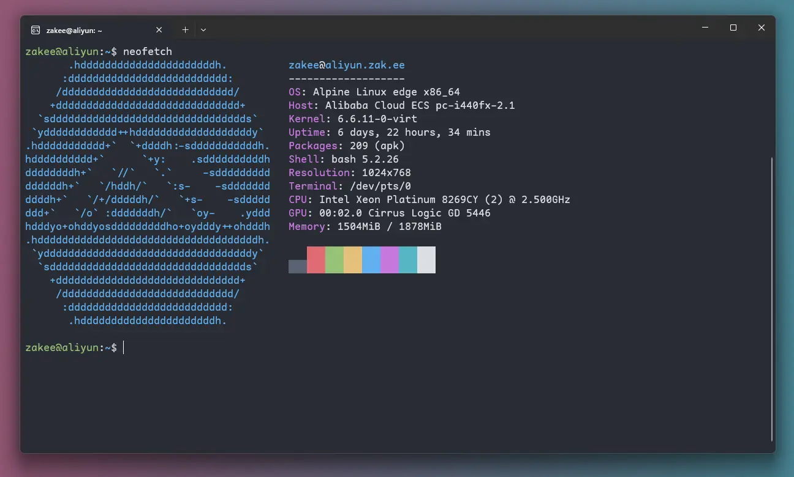

第一次看到“数字基建”这个词是在[这篇博客](https://blog.thetbw.xyz/archives/talk-about-my-self-hosted-service)，其中作者盘点了他搭建的各种自托管服务，而我也是一直热衷于自己搭建各种服务，尤其是近一年多以来，我部署了不少自托管服务，不像之前很多时候都只是搭建玩玩，现在很多服务都是每天必用，已经离不开了的。之前也水过一篇《[Docker时代的自建服务体验](/writing/2022/selfhosted-w-docker/)》，介绍了当时我的Traefik等服务器基础服务的配置，现2023年刚过，不如就对我的VPS使用做一个盘点，也分享一下我的“数字基建”。

## 用过的VPS

第一次折腾服务器/VPS应该还是2016年，当时为了搭建自己的博客，就开始折腾起腾讯云教育优惠1元/月的服务器，从此走上了一条不归路。这么多年来也换过不少VPS了，简单盘点如下：

* **2016年4月~2021年11月**：腾讯云以及阿里云学生机，中间也用过Vultr的机器
* **2021年12月~2022年9月**：Vultr（日本）
* **2022年8月~2022年9月**：DigitalOcean（旧金山）
* **2022年9月~2022年12月**：LightNode（洛杉矶）
* **2022年12月~2023年8月**：腾讯云轻量（新加坡）
* **2023年8月至今**：CloudCone（洛杉矶）
* **2023年10月至今**：阿里云轻量（香港）

目前正在使用的VPS：

| 服务商/区域类型     | 配置                      | 价格        | 备注                  |
| :------------------ | :------------------------ | :---------- | :-------------------- |
| 阿里云/香港轻量     | 2C2G / 60GB / 2TB@30Mbps  | CNY34/月    | 主力机                |
| CloudCone/洛杉矶DC1 | 1C0.5G / 30GB / 3TB@1Gbps | USD9.5/年   | 邮箱、ActivityPub服务 |
| CloudCone/洛杉矶DC2 | 2C2G / 80GB / 3TB@1Gbps   | USD29.26/年 | 8月到期不再续费       |

CloudCone DC2这台本来是我的主力机，但是10月份我又入了阿里云香港轻量。对比CloudCone，阿里云香港的网络质量实在是好太多，我这里的延迟才十几ms，也不丢包，30Mbps带宽可以跑满，虽然价格贵了不少，但考虑到有搭建Minecraft服务器的需求，没办法，因为CloudCone上搭建的MC服务器是完全没办法正常游戏的。目前我的所有服务都已经迁移出，这台CloudCone DC2几乎是闲置的状态，只是偶尔用它build一下Docker镜像，以及连VS Code远程开发，因此我想要出掉它。这台机器是bug机，网络流量使用是不统计的，所以也许是无限流量，如有兴趣收购的话欢迎联系我，按剩余价值便宜出。

CloudCone DC1这台是今年圣诞促销跟风买的，主要是阿里云服务器这边想要开25端口比较麻烦，留一台CloudCone可以继续运行邮件服务，当然也可以搭建其他不方便在阿里云上部署的服务。主要是这个价格实在太优惠了，9.5美金一年，相当于一个月才6块钱，约等于白送😂。

## 基础环境

### OS

关于服务器的操作系统，记得最开始我只敢用Windows系统，迫于配置太低卡得不行，就换成了Linux，直到现在还能回味起当时查遍各种教程，终于搭建好了自己WordPress博客时的成就感，从此Debian就是我最常用的系统了。中间有段时间用的是Ubuntu Server，然而随着系统的更新，乱七八糟的东西越来越多，motd里面打打广告也就算了，后来不知道什么时候开始`apt upgrade`的时候都有广告了，这是真的忍不了。切换回Debian就舒服多了，资源占用也少了，更重要的是Debian完全由社区维护，不会受商业公司决策的影响，而且在全球范围来看，Debian也是最广泛使用的服务器操作系统之一，不用担心找不到资源以及问题的解决方案。就是Debian stable的软件包版本更新比较慢，然而现在很多服务都直接Docker容器部署，软件包更新慢也就影响不大。因此直到今天，Debian依然是我最推荐的服务器Linux发行版。

然而最近我把服务器重装成了[Alpine Linux](https://www.alpinelinux.org/)。经常看见基于这个系统的Docker镜像，我部署的Docker容器已有不少就是基于Alpine，可我竟从没有想过在宿主机上用这个系统。之前研究一键dd脚本，就找到了[leitbogioro/Tools](https://github.com/leitbogioro/Tools)这个，发现它可以一键把服务器系统dd成Alpine，尝试了下，装完后就真香了。首先我惊叹于Alpine Liunx的安装以及开机速度，几乎颠覆了我对快的认知。我用`apk`命令安装了`tree`、`htop`、`screen`、`git`等软件包，安装速度真的飞快，比`apt`快不少。然后我就运行了下`htop`，内存占用才40MB，正在运行的进程寥寥无几，说实话我从来都没有见过这样的`htop`画面。此外，Alpine的磁盘空间占用更是可以忽略不计，真可谓麻雀虽小，五脏俱全，这应该是它会被广泛选为Docker基础镜像的重要原因。

当然，Alpine与Debian区别还是很大的。首先就是Alpine不用systemd，而是用的OpenRC，这让我突然有一种“一夜回到解放前”的感觉，毕竟之前好不容易才习惯了systemd。好在原来的Debian系统上只有两个程序，[webhook](https://github.com/adnanh/webhook/)和[ttyd](https://github.com/tsl0922/ttyd)，是用systemd启动并且需要手动修改service配置文件，转换工作量不大，不过我还是想念用`journalctl`查日志的方便。另外Alpine Linux使用的`musl`与其他Linux发行版使用的`glibc`会有些不同，一些软件包可能用不了，比如VS Code远程就用不了。不过一般我需要的软件包`apk`源里面都可以找到，能用`apk`安装的基本肯定是能用的。另外，我的Alpine版本是Edge，相当于滚动发行版，软件包都很新，这对于我这种更新强迫症来说真的很爽。安装Docker直接`apk add docker`，也不用像Debian stable那样还要添加官方的`apt`源，前两天发布的Docker Engine 25.0我今天就用上了。还有我之前安装Hugo还要从GitHub上下载`.deb`格式的安装包手动安装，现在直接`apk add hugo`，版本更新就隔个几天。

还有，用Alpine之前我竟然都不知道常见的软件都有这么多更轻量的替代品，我一直都喜欢基于KISS[^1]准则设计的软件，原来Linux也可以不用openssh-server，还有dropbear；原来也可以不用`sudo`，还有`doas`。Alpine的简洁小巧真的深得我心，就像对于各种自托管服务一样，我也是更加倾向于简单、轻量的程序。Alpine可能不适合于多数人，但对我来说，Alpine已经完全够用了，这段时间的使用过程中也没碰到什么大问题。只有一个`docker stats`命令不显示内存占用的问题，但这个很快就得到了修复[^2]。

### 服务器管理

服务器我习惯新建一个非root用户，对比直接用root账户来管理服务器，很多操作要加`sudo`（或者`doas`），虽然更麻烦了，但是也降低了用root账户手滑造成毁灭性后果的风险。而且现在有些软件会限制用root用户操作，用root反而麻烦了。另外，不管是什么服务器，我自己新建用户的`UID`和`GID`都是`1000`，这样当我从一个服务器转移一些文件到另一台服务器的时候权限也是对应得上的。

关于服务器远程连接 ，我禁止了root直接登录ssh，并取消了密码登录而只能用ssh密钥。密钥登录不用输密码也挺方便的，在合理保管ssh私钥的前提下也比密码更安全。Windows系统自带了openssh客户端，直接就可以用`ssh`命令连接，再配合Windows Terminal，可以一键连接，所以也不需要各种远程连接软件。还有前面提到`ttyd`这个程序，有了它，我可以在浏览器里面操作命令行，这个主要是方便在不常用电脑上临时操作的情况。当然这个页面我用了[Authelia](https://www.authelia.com/)来加固，后面要讲。


{.big}

再说说服务器的文件管理。之前用过一段时间的VS Code远程插件，挺好用的，还可以配合Docker插件来管理服务器上的Docker。只可惜现在Alpine用不了VS Code远程，可能有办法能用上，可我已经不想折腾了，就用命令行操作好了。另外，命令行下编辑文件可以用[micro](https://micro-editor.github.io/)来替代nano，快捷键没有nano那么阴间，还支持鼠标操作，即便是在终端中编辑各种文本文件也很方便。除此之外我有还有部署[File Browser](https://filebrowser.org/)，也可以在Web界面上管理服务器的文件。

最后再说一下服务器的备份，备份可太重要了。之前我也用过[Kopia](https://kopia.io/)以及[Duplicati](https://www.duplicati.com/)这样的增量备份工具，但是感觉它们对于我的使用场景来说有点重且复杂，特别是Kopia，如果要使用它的GUI，常驻内存占用还挺高的，这让我无法接受，而只用CLI的话又要去写自动备份的脚本，有点麻烦。现在我就用[gobackup](https://github.com/gobackup/gobackup)了，每天凌晨3点全量备份一次到Storj白嫖的空间，保留最近三个历史版本。我要备份的数据都不到100MB，全量备份也没有什么压力，等以后数据量大了再去折腾自动备份脚本，到时候就用Kopia，或者用[rdiff-backup](https://rdiff-backup.net/)两台服务器之间互相备份。

### Docker管理

这个话题[前面有写过](/writing/2022/selfhosted-w-docker/)，不过时间有些久了，实际已经有了很多变化。

首先就是Traefik我已经升级到了3.0-beta版，有些配置需要修改。主要是眼馋3.0支持了Brotli压缩，以及可以指定默认的入口（EntryPoint），这样我后面Docker部署各种应用就更方便了，`labels`里面少写一条。

其次我已经不再使用Portainer。Portainer各种操作反应迟钝，而且后面我更喜欢直接用命令行操作。目前我的大部分Docker容器依然是用docker compose的方式来部署，数据和配置都放到一个目录下，这样备份起来很方便。这个目录结构如下，`apps`目录里面包含了所有的docker compose文件以及应用的持久数据、配置文件，一个子目录对应一个`compose.yaml`文件，一个`compose.yaml`里面可能包含一个或者多个服务。

```
apps
├── base
│   ├── authelia_data/
│   ├── traefik_data/
│   ├── nginx/
│   └── compose.yaml
├── app1
│   ├── data/
│   └── compose.yaml
├── app2
│   ├── data/
│   ├── .env
│   ├── some_config.toml
│   └── compose.yaml
└── …
```

`base`目录下包含最基础的服务：

* [Traefik](https://traefik.io/)：全局唯一的反代服务器，接管整个服务器的80和443端口。
* [Nginx](https://nginx.org/)：处理静态资源，以及作为Traefik错误页面中间件。流量在Traefik这边没有路由匹配的时候就会转发到Nginx，404等各种自定义错误页面也需要交给Nginx来发。
* [Authelia](https://www.authelia.com/)：为应用提供单点登录服务，以及两步验证。
* [Dozzle](https://dozzle.dev/)：可以在网页图形界面上查看Docker容器的日志以及资源占用情况，也可以实现停止或者重启容器操作，而且资源占用极低。

可以发现最关键的就是前三个服务了，没了这三个，我的大部分docker容器都没办法正常访问。你也许会问Nginx不也可以反代，为什么还要用Traefik？首先，Traefik这边直接搞定了https，我永远都不用担心SSL证书续期的问题，而且申请的是Let's Encrypt通配符证书，也配置好了所有的http请求跳转到https以及启用HSTS。其二，Traefik可以自动服务发现。我部署一个Docker容器，只需要用label指定我想用什么域名来访问这个容器以及容器内部的端口号（端口甚至是可选的，因为很多容器默认就暴露一个端口，Traefik会自动配置），容器一启动，Traefik就会通过Docker的API检测到并自动更新它的路由配置，向这个域名的请求就会转发到对应容器，容器甚至不用映射端口到主机网络。而且，由于我已经把域名泛解析到我的服务器，配合通配符证书，我甚至都不用去编辑DNS配置。这些功能仅用Nginx是实现不了的，而且这个体验实在是太好。

比如我想部署个Dozzle，用什么域名访问呢，就`dozzle.zak.ee`好了，于是我用以下docker compose配置启动容器，浏览器打开`dozzle.zak.ee`，直接就能自动跳转https访问了🚀。

```yaml
services:
  dozzle:
    image: amir20/dozzle:latest
    container_name: dozzle
    restart: unless-stopped
    network_mode: bridge
    volumes:
      - /var/run/docker.sock:/var/run/docker.sock:ro
    environment:
      DOZZLE_AUTH_PROVIDER: forward-proxy
      DOZZLE_ENABLE_ACTIONS: true
      DOZZLE_NO_ANALYTICS: true
    labels:
      - "traefik.http.routers.dozzle.rule=Host(`dozzle.zak.ee`)"
      - "traefik.http.routers.dozzle.middlewares=test-compress@file,authelia" #启用Brotli压缩以及由Authelia提供单点登录
      # - "traefik.http.services.dozzle.loadbalancer.server.port=8080" #这句甚至都不需要
```


{.big}

接下来说说Authelia。有些时候我们部署的一些程序带有web界面，但是应用本身没有提供账户登录系统，而我们又想为这些页面设置密码保护，通常的做法是在反代上设置HTTP basicAuth。这是一个方案，但很多时候登录的体验并不友好，比如有些密码管理器不能自动填充，而且这个方案不能“记住密码”，我希望可以登录后一个月都不用再登录。这个时候就需要一个专门管理用户登录的“门户”了，我选择的是Authelia，因为它真的非常轻量，平时占用内存也就20~30MB。类似能实现这类功能的有authentik和Keycloak等，但是它们都太重了。

用户登录基本流程如下，就拿前面的Dozzle来举例吧，Dozzle本身有自己的登录系统，但是也支持用第三方登录，如前面的环境变量已经设置了`DOZZLE_AUTH_PROVIDER: forward-proxy`。当用户访问`dozzle.zak.ee`的时候，Traefik会请求Authelia，将请求的信息包括cookie等提供给Authelia，因为是第一次登录，所以肯定没有有效的cookie，Authelia返回401状态，这个时候Traefik会告诉浏览器302跳转到Authelia提供的登录页面，用户成功登录后就获取到cookie，后续所有请求只要带上这个cookie就能认证通过了。cookie是整个域都有效的，后面再访问其他有Authelia保护的页面也可以直接访问，也就实现了单点登录。除此之外，Authelia这边也能为不同的地址设置不同的规则，有些页面可能仅密码登录安全性不够，还需要启用两步验证，Authelia也可以很方便地实现。

## 那些自托管服务

前面写了很多服务器的基础配置，现在再盘点下我究竟都部署了哪些程序。其实我有一个[Uses](/uses/)页面，里面有简单列出我的自托管服务清单，这里还是稍微多写几句吧，先贴一下目前我的两台服务器运行的Docker容器的情况，资源占用仅供参考。


```
# Aliyun
CONTAINER ID   NAME          CPU %     MEM USAGE / LIMIT     MEM %     NET I/O           BLOCK I/O         PIDS
a37437483530   traefik       0.00%     52.82MiB / 1.835GiB   2.81%     0B / 0B           86.5MB / 11.5MB   9
40e86f627a2e   dozzle        0.00%     11.1MiB / 1.835GiB    0.59%     15MB / 14.8MB     33.1MB / 6.96MB   8
97c09b1fce41   pocketbase    0.00%     24.34MiB / 1.835GiB   1.30%     15.2MB / 4.34MB   152MB / 14MB      9
78de2abd2a4b   gobackup      0.00%     16.6MiB / 1.835GiB    0.88%     19.9MB / 324MB    1.88GB / 1.27GB   6
8a11b296eaa2   mc            8.76%     969.3MiB / 1.835GiB   51.60%    0B / 0B           1.63GB / 1.94GB   45
f1e1e11da5ae   vaultwarden   0.00%     24.55MiB / 1.835GiB   1.31%     17.6MB / 78.1MB   236MB / 29MB      14
30e0a285f2be   nginx         0.00%     1.82MiB / 1.835GiB    0.10%     18.8MB / 42.7MB   23.4MB / 2.7MB    3
67ceef5229cf   authelia      0.02%     24.43MiB / 1.835GiB   1.30%     22.4MB / 54.7MB   179MB / 42MB      8
7273cde82bc1   gitea         0.12%     111.4MiB / 1.835GiB   5.93%     15.3MB / 3.47MB   520MB / 118MB     15
90a1a8c1ee13   filebrowser   0.00%     13.91MiB / 1.835GiB   0.74%     15.1MB / 41.2MB   101MB / 5.06MB    8
c7bc9c5da0cf   yarr          0.00%     19.74MiB / 1.835GiB   1.05%     19.3MB / 1.05MB   207MB / 27.9MB    6
6f67fd32cd70   syncthing     0.01%     39.76MiB / 1.835GiB   2.12%     0B / 0B           203MB / 17.3MB    29
13c28da014c4   dufs          0.00%     388KiB / 1.835GiB     0.02%     16MB / 15.2MB     26.4MB / 635kB    3

# CloudCone
CONTAINER ID   NAME         CPU %     MEM USAGE / LIMIT     MEM %     NET I/O           BLOCK I/O         PIDS
8490169bc6d6   alps         0.00%     13.46MiB / 472.3MiB   2.85%     304kB / 479kB     21.1MB / 2.1MB    10
3aefd375f5bf   maddy        0.03%     14.99MiB / 472.3MiB   3.17%     3.58MB / 5.8MB    32.5MB / 2.27MB   7
684903dc1743   gotosocial   0.00%     65.67MiB / 472.3MiB   13.91%    47.1MB / 18.3MB   458MB / 239MB     9
0a0049dbf231   caddy        0.05%     29.78MiB / 472.3MiB   6.30%     0B / 0B           101MB / 2.64MB    12
```

阿里云服务器上部署的服务如下，这些程序正常运行占的物理内存+swap接近于VPS的物理内存容量：

1. **Minecraft服务器**：这个就不用多说了，是整个服务器上最占资源的程序。没办法，傲慢的Java程序，给多少内存它都能吃完，一启动它就有很多内存被挤进swap，我限制了JVM最多用1G，玩得不凶还是够用的。使用的镜像是`itzg/minecraft-server:java21-alpine`，直接运行在host网络。
1. [**Vaultwarden**](https://github.com/dani-garcia/vaultwarden)：Bitwarden密码管理器的第三方服务端实现，是用Rust写的，比官方的Bitwarden服务端省资源，对个人服务器来说要友好得多。
1. [**Syncthing**](https://syncthing.net/)：一个P2P文件同步工具，之前有写过文章[介绍](/writing/2023/syncthing/)。
1. [**File Browser**](https://filebrowser.org/)：一个Web文件管理器，使用Go编写。我用它管理服务器上的文件，同时也作为网盘使用。因为我的博客文章源文件是用Syncthing同步到服务器，所以也可以用它来临时编辑或发表新的博客文章。
1. [**dufs**](https://github.com/sigoden/dufs)：一个极简的文件列表程序，使用Rust编写。我用它来host我的[公共文件目录](https://public.zak.ee/)。它也可以作为WebDAV服务器来使用，可与File Browser互补，不过我暂时没这个需求。
1. [**Gitea**](https://gitea.io/)：自托管Git服务，使用Go编写。我用它存一些代码，并且会镜像一些GitHub上的仓库，方便访问。
1. [**yarr!**](https://github.com/nkanaev/yarr)：一个简单的RSS阅读器，使用Go编写。它没有花里胡哨的功能，但是该有的功能都有，完美符合我的需求。
1. [**PocketBase**](https://pocketbase.io/)：现正驱动博客的评论功能，详见[这篇文章](/writing/2023/pocketbase-comment/)。

---

CloudCone服务器上部署的服务比较少，就没有用Traefik，直接上Caddy够用了。盘点如下：	

1. [**maddy**](https://maddy.email/)：自建域名邮箱，也是Go写的。在用这个程序之前我一直以为自建域名邮箱系统非常吃配置。我的域名邮箱主要是给各种程序发送邮件通知用的，自己基本不用它来收发邮件。
2. [**alps**](https://git.sr.ht/~migadu/alps)：Web邮件客户端，后端也是Go编写，只是偶尔监看是否有邮件弹回，用这个就够了。
3. [**GoToSocial**](https://gotosocial.org/)：一个ActivityPub协议实现，正如它的名字，也是用Go写的，兼容Mastodon API，但是比Mastodon轻量得多。之前有段时间很多人都抛弃Twitter投入Fediverse的怀抱，也就是在那个时候我接触到了Fediverse，然后就发现了除Mastodon之外的Pleroma、Soapbox、GoToSocial等程序。然而实际部署了GoToSocial之后我就没有发过什么动态，也就关注了几个感兴趣的账号，偶尔看看。

可以发现，我选择自部署程序一个最重要的因素就是它到底占多少内存，所以我爱死了Rust和Go写的程序。内存确实是没办法来虚的，不够就是不够，不得不说部署很多程序然后把服务器内存都占满，真的很有满足感。

## 写在最后

“数字基建”这个词很大，这里讨论的仅仅是一个方面的东西。我们活在互联网时代，与其依赖各种SaaS服务，倒不如将开源世界的资源为我所用，自己来host一些服务，把数据牢牢掌握在自己手里，也让自己网上冲浪更加舒适。希望以上的分享可以为你提供一些启发，囿于篇幅我没有细写配置，毕竟，自己折腾也是一种乐趣。

[^1]: Keep it Simple and Stupid，保持简单和傻瓜。
[^2]: https://gitlab.alpinelinux.org/alpine/aports/-/issues/15506